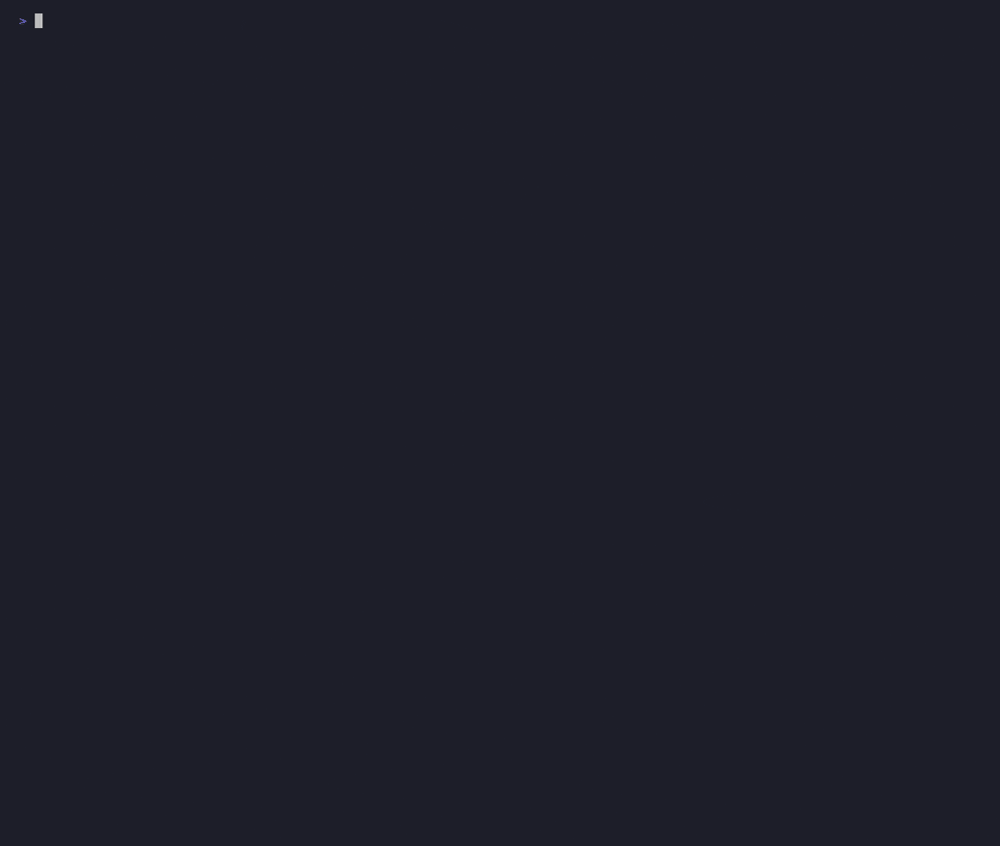

[简体中文](./README.md) · [Website](https://vibegate.lei6393.com) · [GitHub](https://github.com/SuperMarioYL/vibegate)

<picture>
  <source media="(max-width: 600px) and (prefers-color-scheme: dark)" srcset="./assets/presentation/hero-mobile-dark.svg">
  <source media="(max-width: 600px)" srcset="./assets/presentation/hero-mobile-light.svg">
  <source media="(prefers-color-scheme: dark)" srcset="./assets/presentation/hero-dark.svg">
  
</picture>

# VibeGate

**See the next issue to fix before sharing an app.**

VibeGate combines a static project check, license-policy findings and a startup run into a bilingual red/yellow/green report with concrete next-step hints.

## Why use it

A project may run in a developer’s shell while missing a README, relying on local configuration or failing a fresh start. Separate checks show which of those conditions needs attention.

- **Separate the checks** — Readiness, license and startup retain their own results.
- **Explain the next change** — Findings include bilingual remediation hints.
- **Keep a structured report** — JSON exposes the same checks as the terminal view.

## Architecture

<picture>
  <source media="(max-width: 600px) and (prefers-color-scheme: dark)" srcset="./assets/presentation/architecture-mobile-dark.svg">
  <source media="(max-width: 600px)" srcset="./assets/presentation/architecture-mobile-light.svg">
  <source media="(prefers-color-scheme: dark)" srcset="./assets/presentation/architecture-dark.svg">
  
</picture>

The CLI detects runtime markers and loads .vibegate.yml. Readiness and license scanners collect findings. The startup path copies the project to a temporary directory, installs dependencies when present and runs its start command with a reduced environment and timeout. The report takes the worst check status.

| Component | Responsibility |
| --- | --- |
| `Project + config` | src/config.ts |
| `Static checks` | src/scan |
| `Temporary startup` | src/run/sandbox.ts |
| `Bilingual verdict` | src/report |

## Install and quickstart

Use the runtime version declared in the repository manifest. The source installation below makes the included example reproducible.

```bash
git clone https://github.com/SuperMarioYL/vibegate.git
cd vibegate
npm ci
npm run build
```

Node.js 20+; the demo creates its own complete app without dependencies, so the two startup checks need no registry access.

```bash
node examples/presentation-demo.mjs
```

## Recorded demo

<picture>
  <source media="(max-width: 600px) and (prefers-color-scheme: dark)" srcset="./assets/presentation/process-mobile-dark.svg">
  <source media="(max-width: 600px)" srcset="./assets/presentation/process-mobile-light.svg">
  <source media="(prefers-color-scheme: dark)" srcset="./assets/presentation/process-dark.svg">
  
</picture>

The fixture moves from red to green after adding its README and correcting the startup exit status.

```text
{
  "stage": "before",
  "verdict": "red",
  "checks": [
    {
      "id": "readiness",
      "status": "fail",
      "codes": [
        "no-readme"
      ]
    },
    {
      "id": "license",
      "status": "pass",
      "codes": []
    },
    {
      "id": "clean-run",
      "status": "fail",
      "codes": [
        "crash"
      ]
    }
  ]
}
{
  "stage": "after",
  "verdict": "green",
  "checks": [
    {
      "id": "readiness",
      "status": "pass",
      "codes": []
    },
    {
      "id": "license",
      "status": "pass",
      "codes": []
    },
    {
      "id": "clean-run",
      "status": "pass",
      "codes": []
    }
  ]
}
```

The complete command and output are recorded in [docs/demo-results.json](./docs/demo-results.json). Inputs and reproduction code are included in the repository.



The existing recording is retained for context; the text example above documents the reproducible scenario.

## Usage

Run these commands from the repository root after installation. Replace paths for your own data.

```bash
node dist/cli.js scan examples/demo-app --no-json
node dist/cli.js run examples/demo-app --timeout 3000 --no-json
# Run all checks on a project you trust:
node dist/cli.js examples/demo-app --timeout 3000
```

## Configuration

.vibegate.yml sets timeoutMs (30000 by default), copyleftAllowlist, extraSecretPatterns and writeReport. --timeout overrides startup timeout; --no-json disables report writing. scan performs static checks; run performs startup only; a bare path performs all three. Reports normally go to the project as vibegate-report.json; a read-only project can cause a home-directory fallback. Tests and common build directories are excluded from static production-source scans.

```yaml
timeoutMs: 30000
copyleftAllowlist: []
extraSecretPatterns: []
writeReport: true
```

## Integrations and responsibilities

<picture>
  <source media="(max-width: 600px) and (prefers-color-scheme: dark)" srcset="./assets/presentation/integrations-mobile-dark.svg">
  <source media="(max-width: 600px)" srcset="./assets/presentation/integrations-mobile-light.svg">
  <source media="(prefers-color-scheme: dark)" srcset="./assets/presentation/integrations-dark.svg">
  
</picture>

Choose the input and output route that matches your workflow. The local example below exercises the stated subset.

| Route | Implemented role |
| --- | --- |
| Node / Bun manifests | Runtime and startup detection |
| Mini-program markers | Static checks; startup skipped |
| Installed package metadata | License policy flags |
| .vibegate.yml | Timeout and scanner settings |
| JSON + terminal | Bilingual findings and fix hints |

## Limits and next steps

- The temporary directory and reduced environment are not an OS security sandbox. A full run can install dependencies and execute project scripts with host access; inspect unfamiliar projects first.
- A green report covers only the checks performed, not deployment readiness, legal clearance or absence of vulnerabilities. License labels are configurable review signals.
- Red/yellow findings do not currently set a failing CLI exit by themselves. Inspect report.verdict for automation. Long-running servers may hit the timeout even when functioning, and mini-program startup is skipped.

Broader runtime acceptance, server-health checks and hosted report sharing are future directions. Preserve the JSON report when investigating a traffic-light result.

## License and contributions

See [LICENSE](./LICENSE). When reporting an issue, include a minimal input, the command, and the observed output.
