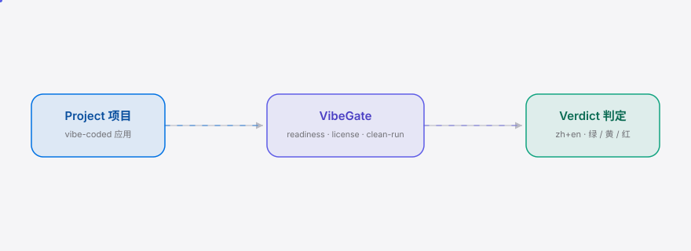

<div align="right"><sub>[English](./README.en.md)&nbsp;&nbsp;⇄&nbsp;&nbsp;<b>简体中文</b></sub></div>

<picture>
  <source media="(prefers-color-scheme: dark)" srcset="./assets/hero-dark.svg">
  <source media="(prefers-color-scheme: light)" srcset="./assets/hero-light.svg">
  
</picture>

<p align="center"><sub>VibeGate 是本地就绪闸门——为非开发者把 vibe-coding 出来的应用放行。</sub></p>

<p align="center">
  <a href="./LICENSE"></a>
  
  
  
  
  
</p>

**一条命令，给国产模型 vibe-code 出来的小程序做本地体检——能不能在干净环境跑起来、是不是生产可用、许可证/版权干不干净，红黄绿一句话说清，不用账号也不用懂技术。**

<h2> 架构</h2>

<picture>
  <source media="(prefers-color-scheme: dark)" srcset="./assets/atlas-dark.svg">
  <source media="(prefers-color-scheme: light)" srcset="./assets/atlas-light.svg">
  
</picture>

单进程、单 npx 包。三个纯模块喂给同一个报告器：**readiness**（静态启发式扫文件）、**license**（许可证枚举 + copyleft 判定 + 版权头嗅探）、**clean-run**（临时沙箱里全新装依赖、30s 超时启动子进程）。三者汇总成一个双语 `VerdictReport`，既是终端红黄绿判定，也是机器可读的 `vibegate-report.json`。无 Docker、无守护进程、无云——非开发者的机器上没有这些。

## 目录

- [为什么做这个](#为什么做这个)
- [安装与快速开始](#安装与快速开始)
- [用法](#用法)
- [demo](#demo)
- [配置](#配置)
- [付费](#付费)
- [路线图](#路线图)
- [许可证](#许可证)

<h2 id="为什么做这个"> 为什么做这个</h2>

一个非开发者让 AI 模型（豆包 / 元宝 / DeepSeek / 通义 / Gemini）给自己生成了一个看起来能用的应用，但他拿着这个文件夹回答不了三个问题：**它在干净环境能不能跑起来、它算不算生产可用、它的许可证/版权干不干净？** 这三个问题各自是一道专业门槛（运维、发布工程、法务），而 vibe-coder 一道都没有。这不是懒——是 gauntlet：多工具、多学科，且预设了用户恰好不具备的专业知识。

而且后果不是理论上的：Codeberg 已经在封 vibe-code 出来的项目，理由正是许可证模糊。一旦平台会动手，"许可证干不干净" 就不再是可选项。VibeGate 把这道 gauntlet 压成一条本地命令，输出双语红黄绿判定——开发者不在场，非开发者也读得懂。

> **不是又一个扫描器。** license-checker 吐许可证清单、npm audit 吐 CVE、`node .` 吐崩溃堆栈——它们各自吐原始列表，没有一个吐判定。VibeGate 的产品就是这个判定本身，扫描器只是输入。

| 维度 | 手动拼装（license-checker + npm audit + node .） | VibeGate |
|---|---|---|
| 一条命令出判定 | — | ✓ |
| 非开发者可读 | — | ✓ 双语红黄绿 |
| 干净环境实跑 | partial（自己搭沙箱） | ✓ 临时沙箱 + 30s 超时 |
| 许可证 / 版权 | partial（要会读 SPDX） | ✓ copyleft 自动分级 |
| 企业级深度审计 | ✓（FOSSA / Snyk 强） | —（只做 60s yes/no） |

<h2 id="安装与快速开始"> 安装与快速开始</h2>

发布后，终端用户一行命令（无需账号、无需懂技术）：

```bash
npx vibegate@latest ./my-app
```

现在（v0.1.0 发布前）从源码 3 条命令即可看到红黄绿判定：

```bash
git clone https://github.com/SuperMarioYL/vibegate && cd vibegate
npm install && npm test
npx tsx src/cli.ts ./examples/sloppy-mini-program
```

<details>
<summary>样本输出（sloppy-mini-program → 红灯 RED）</summary>

```
════════════════════════════════════════════════════════
  VibeGate 本地体检结果  examples/sloppy-mini-program
════════════════════════════════════════════════════════
  ● 红灯 · 请勿直接发布
  ✗ 生产就绪体检
      ✗ 缺少 README（非开发者无法判断项目用途与启动方式）
      ⚠ 缺少 lockfile（依赖版本不固定，干净环境可能装出不同结果）
      ✗ node_modules/ 被提交进仓库（体积巨大且混入本地密钥的风险高）
      ⚠ 缺少 .gitignore（node_modules/ 与密钥文件容易误提交）
      ⚠ package.json 未声明 license 字段
      ✗ 疑似硬编码密钥 / 凭据  (app.js:20  AKID…34)
      ⚠ 生产路径残留 console.log  (app.js:24)
  ✗ 许可证 / 版权
      ⚠ 源码含第三方版权头（疑似拷贝的开源代码）  (app.js:5)
      ✗ 依赖 somepkg@1.0.0 为 GPL-3.0-only（强传染 copyleft）
  ✗ 干净环境实跑
      ✗ 干净环境启动崩溃  (exit 1  — MY_CONFIG_TOKEN env var is required)
════════════════════════════════════════════════════════
  首要修复建议（怎么修）
   1. ✗ 缺少 README
   2. ✗ node_modules/ 被提交进仓库
   3. ✗ 疑似硬编码密钥 / 凭据
════════════════════════════════════════════════════════
─ VibeGate local readiness verdict ─  (en block below)
```

</details>

<h2 id="用法"> 用法</h2>

```bash
vibegate scan ./my-app            # 只做静态体检：readiness + 许可证 / 版权
vibegate run  ./my-app            # 只做干净环境实跑
vibegate      ./my-app            # 一条命令：scan + run 全套（体验路径）
vibegate run  ./my-app -t 10000   # 10s 超时
vibegate scan ./my-app --no-json  # 不写 vibegate-report.json
```

判定总是双语（zh 主 + en 副区块）打印到 stdout，并默认写出机器可读的 `vibegate-report.json`（未来托管徽章就是重新渲染这份 JSON）。判定规则见 [docs/verdict-rubric.md](./docs/verdict-rubric.md)。

项目可在仓库根放 `.vibegate.yml` 覆盖默认值；可用 `examples/sloppy-mini-program/` 和 `examples/demo-app/` 两个示例项目试跑。

<h2 id="demo"> demo</h2>


录屏脚本见 [docs/demo.tape](./docs/demo.tape)（vhs 驱动真实二进制，CI 可一键重渲染到 `assets/demo.gif`）。

<h2 id="配置"> 配置</h2>

项目根目录可选 `.vibegate.yml`：

| key | type | default | meaning |
|---|---|---|---|
| `timeoutMs` | number | `30000` | 干净环境实跑超时（毫秒） |
| `copyleftAllowlist` | string[] | `[]` | 已确认可接受的 copyleft 包名（按名跳过） |
| `extraSecretPatterns` | string[] | `[]` | 额外的密钥正则（叠加在内置模式上） |
| `writeReport` | boolean | `true` | 是否写出 `vibegate-report.json` |

```yaml
# .vibegate.yml
timeoutMs: 20000
copyleftAllowlist:
  - somepkg   # 已法务确认可接受
```

<h2 id="付费"> 付费</h2>

**托管判定徽章：¥29 / 份**（或 ¥99 / 月无限）。把本地跑出的 `vibegate-report.json` 重新渲染成可贴的 SVG 徽章 + 私密可分享链接 `vibegate.app/r/<id>`，给在小红书 / 微信发产品帖的独立开发者一个可背书的信任信号——徽章比可伪造的截图更可信。本地 CLI 已经吐这份 JSON，托管服务只是重新渲染，不是画饼。

本地 CLI 永久免费、开源 MIT——信任先建立，¥29 把信任变成可分享的徽章。v0.1 聚焦开源积累信任；托管徽章为 v0.2 付费功能（见路线图）。

<h2 id="路线图"> 路线图</h2>

- [x] 静态体检：readiness 启发式 + 许可证 / 版权扫描 + 双语红黄绿判定
- [x] 干净环境实跑：临时沙箱 + 全新装依赖 + 30s 超时崩溃捕获
- [x] 一条命令体验：`vibegate ./my-app` 合并 scan + run
- [ ] npm 发布 `vibegate@0.1.0` + asciinema demo 录制
- [ ] v0.2 托管判定徽章 + 可分享报告链接（¥29 / 份）
- [ ] v0.3 跨运行时支持（Python / Go 项目）

<h2 id="许可证"> 许可证</h2>

MIT — 详见 [LICENSE](./LICENSE)。欢迎在 [issues](https://github.com/SuperMarioYL/vibegate/issues) 提反馈或 PR。

<p align="center"><sub><a href="./LICENSE">MIT</a> © 2026 SuperMarioYL</sub></p>
